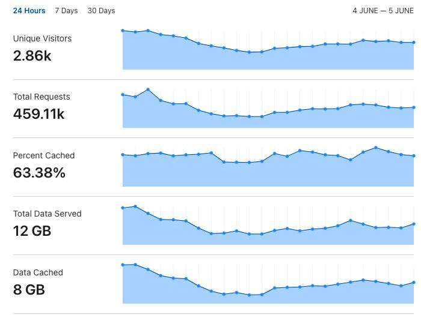

# Hosting a CTF — SEETF 2022 Organizational and Infrastructure Review

## Introduction

[SEETF 2022](https://ctftime.org/event/1543/) was the inaugural security Capture the Flag (CTF) competition hosted by the [Social Engineering Experts](https://ctftime.org/team/151372) CTF team. Once again, congratulations to the top teams!


The idea to host SEETF started way back in December 2021 - having played CTFs for a year now, we wanted to bring something new to the table in the local (Singapore) CTF scene. We decided to open up SEETF to a more international audience, as we have not seen any Singapore CTF team do so previously.

Here's an overview of the content in this post - feel free to skip to the relevant parts!

* [Statistics](hosting-a-ctf-seetf-2022-organizational-and-infrastructure-review.md#statistics)
* [Getting the Word Out](hosting-a-ctf-seetf-2022-organizational-and-infrastructure-review.md#getting-the-word-out)
* [Infrastructure That Survives the First 10 Minutes](hosting-a-ctf-seetf-2022-organizational-and-infrastructure-review.md#infrastructure-that-survives-the-first-10-minutes)
* [Feedback and Areas for Improvement](hosting-a-ctf-seetf-2022-organizational-and-infrastructure-review.md#feedback-and-areas-for-improvement)
* [Closing Thoughts](hosting-a-ctf-seetf-2022-organizational-and-infrastructure-review.md#closing-thoughts)

## Statistics

We had a total of **2053 users** and **1206 teams**, which I'd argue is not too shabby for our first-ever CTF. Of these teams, **740** solved at least one challenge.


#### Solve Distributions

One Pwn challenge (Huffbleed) remained unsolved at the end of the CTF.

The challenges with the lowest number of solves were:

* Rev / SudoCV - 2 solves
* Web / Charlotte's Web - 2 solves
* Web / Flagportal Revenge (Flag 1) - 2 solves
* Crypto / Modifiability - 1 solve
* Rev / Susware - 1 solve
* Rev / It's Right There - 1 solve
* Web / XSPwn - 1 solve
* Web / Flagportal Revenge (Flag 2) - 1 solve

#### Beginner-Friendly Challenges

To help beginners figure out what to work on first, we had some challenges labelled as "Beginner Friendly". These challenges came with extra links and resources to get beginners to the category started on the challenge.


Of the **14** beginner-friendly challenges, **12** had more than 50 solves (which was the decay limit of our dynamic scoring algorithm). This was better than expected, as we had a rather hard time measuring the difficulty of challenges and deciding which challenges were truly beginner-friendly.

## Getting the Word Out

According to our survey, the majority of our participants came from [CTFtime](https://ctftime.org/team/151372), followed by Word of Mouth and Discord.


### Discord

We didn't do anything fancy here, just reached out to a few local and international CTF interest groups on Discord. Be careful of server rules when doing this, though - it's generally not good to self-promote on another server unless there is a specific channel for it (e.g. an upcoming CTFs channel).

### CTFtime

CTFtime allows teams to create [upcoming events](https://ctftime.org/event/list/upcoming), which anyone from anywhere in the world could check out. This helped us to reach a very international audience, with our largest traffic sources being **Singapore, Vietnam, the United States, India,** and **the United Kingdom**.


One thing we did well was to get our CTF listed on CTFtime as early as possible so that there was more time to gain traction. Since many teams decide which CTF to participate in by looking at the number of "interested teams", this may have led to a snowball effect and played a huge role in getting more teams to play our CTF.

Here's a screenshot of the CTFtime upcoming events page the week before our CTF.


### Sponsors

We prepared a sponsorship prospectus that provided the details of the CTF, and what sponsors could hope to gain from it (recruitment, publicity, etc.)

We got most of our sponsors through cold-emailing, and mostly relied on our team's track record as CTF players (since we had pretty much zero track record as CTF _organizers_). We are really grateful to all our sponsors who believed in us!

This CTF was a crucial first step though, and I'm excited to see what's in store for SEETF 2023 now that we have a proven track record as a CTF organizer!

## Infrastructure That Survives the First 10 Minutes

Aside from a few minor blips in the first few hours (which were usually resolved within minutes), we had zero downtime in our infrastructure.

### Cloudflare

Our CTFd platform was additionally put behind Cloudflare. This allowed us to enforce JavaScript challenges to prevent DDOS and bruteforce attacks.

Clients will receive an interstitial page containing a JS challenge (or captcha, if the JS challenge doesn't work) before being deemed as legitimate traffic and allowed through. We initially set the validity period of the JS challenge to 30 minutes, before relaxing it to 4 hours after traffic slowed down as the CTF progressed.

This helped us to block plenty of suspicious requests, such as this vulnerability scan and more than 35,000 other similar requests.


One side effect of this was that participants could no longer `wget` or `curl` the challenge files directly and have to use the CTFd GUI, so we set a custom rule to allow all traffic to `/files/*`.


This additionally allowed us to cache most of our requests (a whopping **63%**!) which reduced the load on our backend.



### CTFd Platform

This time, our CTFd platform was hosted by [Cyber League](https://cyberleague.co/). This was a simple Gunicorn setup with 8 workers. The additional workers were important - the default number of workers in the [Docker Compose file](https://github.com/CTFd/CTFd/blob/master/docker-compose.yml) is 1, which is insufficient to handle anything more than a few hundred participants.&#x20;

```yaml
  ctfd:
    build: .
    user: root
    restart: always
    ports:
      - "8000:8000"
    environment:
      - UPLOAD_FOLDER=/var/uploads
      - DATABASE_URL=mysql+pymysql://ctfd:ctfd@db/ctfd
      - REDIS_URL=redis://cache:6379
      - WORKERS=1
      - LOG_FOLDER=/var/log/CTFd
      - ACCESS_LOG=-
      - ERROR_LOG=-
      - REVERSE_PROXY=true
```

To customise our platform, we hacked together a theme adapted from ["Pixo Theme" by PRI4CE](https://github.com/hmrserver/CTFd-theme-pixo). Our main addition was this custom "Achievements" feature in each team's page, which allowed us to add some goals (and jokes) for our participants.

It was just a small client-side JavaScript gimmick, but it helped to keep participants engaged :smile:


### Kubernetes Challenge Cluster

Our challenge infrastructure was [sponsored by Google Cloud](https://goo.gle/ctfsponsorship). This meant that we spent nothing on infrastructure! :tada:

To deploy our challenges, we had two options.

1. The "standard" method of using Docker Compose to run all our challenges on a single / a few VMs.
2. Using [Google Kubernetes Engine](https://cloud.google.com/kubernetes-engine), which was more scalable and provided more redundancy.

I wanted to achieve zero downtime, so I challenged myself to learn Kubernetes, which was a scary beast...

#### What Even is a Kubernetes?

As someone who is still new to this, here's a TL;DR of what you need to know:

* A _Node_ is a virtual machine that can run containerised applications.
* A Kubernetes _Cluster_ is a set of nodes. For our challenge cluster, we had 6 nodes running simultaneously during the CTF - this was scaled down to 2 nodes after the CTF was over.
* _Pods_ are the smallest deployable units in Kubernetes. Each of these will run a single instance of a containerised application.
* Kubernetes provides horizontal scaling by allowing us to use _Replicas_, which are multiple pods running the same application. These replicated pods can run across multiple nodes in the cluster, and are managed as a group. For each challenge, we ran 4 pods.
* A _Service_ is a way for us to expose these pods. We used the ClusterIP service to expose each pod internally. This provides load balancing across the 4 pods of each challenge.

.png>)

#### Deploying our Challenges on Kubernetes

Our challenges were written and submitted as dockerised applications, each with a `docker-compose.yml` file. This made my life slightly easier as there exists a tool called [Kompose](https://kompose.io/) to convert `docker-compose.yml` files to their equivalent Kubernetes configurations.

Here's an example of the Deployment configuration used by one of our challenges, which configures the Pods that we want to run.

```yaml
apiVersion: apps/v1
kind: Deployment
metadata:
  annotations:
    kompose.cmd: kompose convert
    kompose.version: 1.26.1 (a9d05d509)
  creationTimestamp: null
  labels:
    io.kompose.service: app
  name: app
  namespace: weirdmachine
spec:
  replicas: 4
  selector:
    matchLabels:
      io.kompose.service: app
  strategy: {}
  template:
    metadata:
      annotations:
        kompose.cmd: kompose convert
        kompose.version: 1.26.1 (a9d05d509)
      creationTimestamp: null
      labels:
        io.kompose.service: app
    spec:
      enableServiceLinks: false
      automountServiceAccountToken: false
      containers:
        - env:
            - name: FLAG
              value: SEE{und3r6r4d_4dm15510n5_4r3_cr4zy_7fc37a510e35d46075f70325295f4526}
            - name: PYTHONUNBUFFERED
              value: "1"
          image: gcr.io/OUR_PROJECT_ID/weirdmachine/app
          name: app
          ports:
            - containerPort: 5000
          resources: {}
      restartPolicy: Always
status: {}

```

We would need to use Docker or Docker Compose to first push the corresponding image to `gcr.io/OUR_PROJECT_ID/weirdmachine/app` before applying the above configuration.

Once the Deployment configuration is applied, the image is pulled and 4 replicas of this application are run across our Kubernetes cluster. This is the "actual" application that is being run - now we need a way to expose it.

The Service configuration is what exposes the Deployment to other applications and the Internet. For example, this configuration will tell GKE to spin up a Layer 4 TCP load balancer and expose the above deployment on port 20001.

```yaml
apiVersion: v1
kind: Service
metadata:
  annotations:
    kompose.cmd: kompose convert
    kompose.version: 1.26.1 (a9d05d509)
  creationTimestamp: null
  labels:
    io.kompose.service: app
  name: app
  namespace: weirdmachine
spec:
  ports:
    - name: "20001"
      port: 20001
      targetPort: 5000
  selector:
    io.kompose.service: app
  type: LoadBalancer
  loadBalancerIP: "OUR_IP"
status:
  loadBalancer: {}

```

#### Some Gotchas

Some of our challenges could not be deployed on Kubernetes without running into some issues. For instance, I ran into [this issue](https://github.com/Zenika/alpine-chrome/issues/109) when trying to deploy the client-side web challenges, which use Chromium instances. In this case we had to spin up another VM to run these challenges using the "standard" way with Docker Compose.

**There might also be potential security issues if you're not careful.**  Be extra careful to configure these settings to disable mounting of tokens and injection of environment variables. Since many challenges allowed players to have filesystem access, the mounting of the service account token could have led to a **complete project takeover**.

```yaml
  spec:
    enableServiceLinks: false
    automountServiceAccountToken: false
```

Some extra precautions took to protect ourselves were:

* Using [Workload Identity](https://cloud.google.com/kubernetes-engine/docs/how-to/workload-identity) to protect access to sensitive metadata from the GCP metadata endpoint
* Configuring [network policies](https://kubernetes.io/docs/concepts/services-networking/network-policies/) to restrict egress traffic to only public IPs and pods belonging to the same challenge.

#### HTTP Load Balancing

Using the L4 load balancer is all well and good, but this doesn't allow us to configure things like rate-limiting by IP, placing requests in a queue, etc.

I was also the most worried about the web challenges since these are usually the ones that get scanned very excessively (even though running scanners is against most CTF's rules).

To solve this, I decided to go with using the L4 load balancers for TCP (Netcat-based) challenges, while at the same time using HAProxy for the web challenges. It ended up looking a little something like this:


The HAProxy instances themselves were deployed as a Service to avoid a single point of failure.

### HAProxy

These HAProxy features helped a lot and probably contributed significantly in protecting our web challenges from excessive load.

#### IP-based Rate Limiting

In HAProxy you configure "frontends" and match them to various backend servers based on whatever logic you see fit. In our frontend we are able to configure an IP-based rate limiting rule that allows no more than 20 requests per client every 10 seconds.

```
# WEB
frontend fe-main
    bind *:8000
    tcp-request connection reject if { src -f /etc/haproxy/blacklist.lst }
    
    # Allow no more than 20 requests per client in the last 10 seconds
    stick-table  type ip  size 1m  expire 10s  store http_req_rate(10s)
    http-request track-sc0 src
    http-request deny deny_status 429 if { sc_http_req_rate(0) gt 20 }

    default_backend no-match
    use_backend %[req.hdr(host),lower,word(1,:)]
```

#### Connection Limits and Queues

[This feature](https://www.haproxy.com/blog/protect-servers-with-haproxy-connection-limits-and-queues) is super useful. In a nutshell, we are able to configure the maximum number of concurrent connections we let through to each backend server - this avoids overwhelming the backend servers with more requests than they can handle, and pretty much guarantees that the backends will survive, even if the clients themselves might experience more latency.

Here, we have configured a maximum of 100 concurrent connections **between HAProxy and the backend for the log4security challenge.** There can be a lot more connections between clients and HAProxy itself, as specified in the global settings.

```
global
    maxconn 60000
    
...

backend log4security.chall.seetf.sg
    mode http
    timeout queue 10s
    server log4security app.log4security.svc.cluster.local:10002 	check  maxconn 100
```

When the 100-connection treshold is reached, additional clients are put in a queue with a timeout of 10 seconds. If the queue doesn't clear up and a response is not given at the end of 10 seconds, a 504 Gateway Timeout is returned.

.png>)

This means that the actual backend server will never be processing more than 100 requests at a time, which is something most web servers should be able to handle. The idea is that it is better for _some_ clients to experience more latency than it is for the backend server to get overwhelmed.

#### Statistics Page

This is more of a quality-of-life thing, but it really helps to have a summary of traffic across all services.


## Feedback and Areas for Improvement

We released a survey form, which received more than 170 submissions - thanks a lot for your feedback!

Overall, it seems that we have hit our target audience pretty well. While most are experienced CTF players, we managed to reach a significant number of people who have had no or little prior experience in CTFs, whom our beginner-friendly challenges are geared towards.


Challenge difficulty was particularly hard for us to estimate since we have never organized a CTF before. Overall, it seems like the consensus was that SEETF was at least on par with, if not harder than most other CTFs. This outcome was better than what we expected: we were afraid that 48 hours might have been too much time, and that the top teams would find the challenges too easy.

While I agree there were many tough challenges that kept the top teams occupied throughout the entire duration of the CTF, I believe that the beginner-friendly challenges were sufficiently approachable - 435 teams solved "Sourceless Guessy Web (Baby Flag)", and 382 solved "Regex101".


Additionally, it seems that the duration of 48 hours was just right for this CTF, which means that it was probably appropriate considering the number of challenges and their difficulty.


We also had a section asking participants to rate the challenge quality of each category. I won't talk about the specific scores but the responses have been pretty encouraging, with most categories averaging at around 4/5.

### Support Issues

Initially we tried using [ModMail](https://modmail.xyz/) for support tickets, but this quickly caused more problems than it solved because some people were unable to create tickets successfully due to their Discord privacy settings.

We eventually added [Ticket Tool](https://tickettool.xyz/) and let participants choose which one they preferred.

Another complaint was that some challenges were left unsupported for a few hours, because the challenge author was sleeping. Most of our team (all but one member) is currently based in Singapore, so we were not able to handle most tickets that were created after midnight.&#x20;

A way to resolve this could be to have all admins take shifts, though I don't think this was a huge issue as these tickets were almost always eventually closed with "Challenge is working as intended".

There were also a lot of support tickets from people asking for hints, which we do not ever provide in private. This ended up being a huge waste of time and delayed our response to more legitimate tickets. I wonder if there is a way to create a more interactive ticketing system where the user could select what their issue is related to - this would allow us to create a filter system or at the very least group the less urgent / important tickets together.

## Closing Thoughts

I'm frankly very happy with how this event turned out - we had way more participants than expected, and the infrastructure had almost no downtime (even with the more-than-expected load).

The response to this question was probably the most encouraging of all. We can't wait to see everyone again next year!


