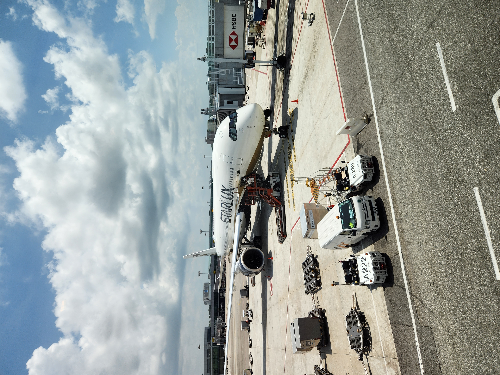
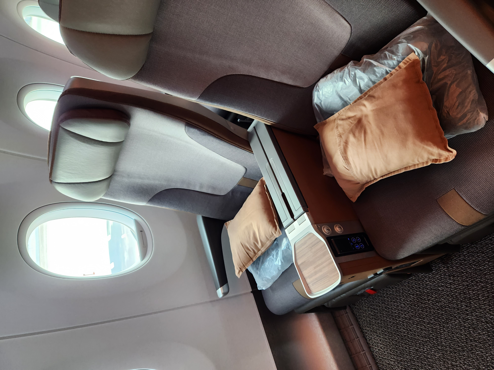
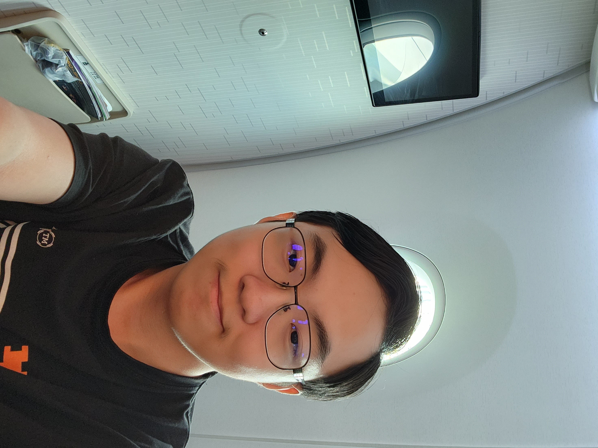
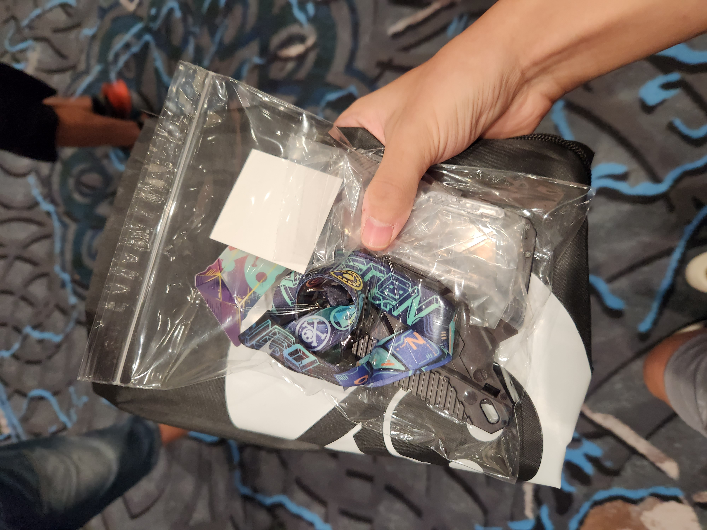

# DEF CON 31 CTF && Midnight Sun CTF Finals 2023

<figure><figcaption></figcaption></figure>

This past month, I travelled to 3 countries: USA, Germany, and Sweden. I participated in the **DEF CON 31 CTF finals** with my team, **Blue Water** (a collaboration between Perfect Blue, Water Paddler, Samsung Research, Tea Deliverers, and Georgia Tech SSLab), and **Midnight Sun CTF** with a Singaporean team, **ThreeTop Walk**. This post serves as proof that I touched grass along the way.

## Los Angeles

Flights from Singapore directly to Vegas were expensive. However, an open secret is that booking two separate flights for SIN-LAX and LAX-LAS (instead of a single booking with a layover) is a much cheaper option. This was the obvious choice for me, allowing me to visit a different state while not feeling bad about taking too much money from the team funds.

I decided to arrive in the US slightly earlier to get rid of jetlag by the time the CTF comes around, so I stayed in LA for 3 days before going to Vegas. When I was booking my flights, the cheapest option was [STARLUX](https://www.starlux-airlines.com/en-Global), a new-ish Taiwanese airline. Interestingly enough, the economy class seats ran out, but the premium economy tickets were still _cheaper_ than the economy options of other available flights.

### STARLUX Airlines

Before I knew it, I was on my way to LAX! This journey consisted of a relatively short flight to Taipei, Taiwan, followed by a long flight to the US.

I was no stranger to long-haul flights, but this was honestly _the_ best experience I ever had with any airline. I was able to choose my seat (for free!) and I got an aisle seat at the very front of the plane for both flights. The seats were super comfortable and there was a lot of legroom. Being literally the first person in economy class to get off both flights was also super cool.

<figure><figcaption></figcaption></figure>

 

<figure><figcaption></figcaption></figure>

The entertainment screens were also very high-resolution, and the service was great!

<figure><figcaption></figcaption></figure>

 

<figure><figcaption></figcaption></figure>

Looking back, this did not feel like premium economy at all. I know which flight I'm taking next time!

### Taiwan Layover

I had a 4-hour layover at Taoyuan International Airport in Taiwan. I had some chicken rice and played a random CTF to pass the time.

<figure><figcaption></figcaption></figure>

### LA at Last

I was staying at an Airbnb in Anaheim. It was super cozy and instagrammable, but far from Hollywood and other tourist attractions in LA - it was $50 to get an Uber to Hollywood Boulevard. Looking back, lower Uber costs might have made up for the cost of a more expensive Airbnb closer to where things are.

<figure><figcaption></figcaption></figure>

 

<figure><figcaption></figcaption></figure>

### Hollywood Boulevard

On my first day, I met up with some Water Paddler teammates and watched Oppenheimer at [TCL Chinese Theatres](https://www.tclchinesetheatres.com/)! It was my first time watching IMAX in a very long time, and the movie definitely didn't disappoint.

<figure><figcaption></figcaption></figure>

 

<figure><figcaption></figcaption></figure>

After the movie, we walked around the boulevard and had lunch. Then we almost walked into a Church of Scientology building for a free personality test, but some people chickened out.

<figure><figcaption></figcaption></figure>

 

<figure><figcaption></figcaption></figure>

We then went to visit [University of Southern California (USC)](https://www.usc.edu/), where some of my teammates were studying. USC was one of the schools that I was unfortunately rejected from, so it was interesting to visit what "could have been". The school also has a "CTF" building which was pretty funny.

<figure><figcaption></figcaption></figure>

 

<figure><figcaption></figcaption></figure>

### Universal Studios Hollywood

The next day, we visited [Universal Studios](https://www.universalstudioshollywood.com/web/en/us/). My favourite part of the theme park was the Studio Tour, where you get to visit actual sets used to shoot movies and TV shows. The Harry Potter and Super Mario areas were also super fun as usual. My only complaint was that the weather was way too hot! Thankfully, there were many indoor rides to escape the heat.

<figure><figcaption></figcaption></figure>

 

<figure><figcaption></figcaption></figure>

In the evening, we checked out Venice Beach and [Santa Monica Pier](https://www.santamonicapier.org/). There was a skate park at Venice Beach where people were doing cool tricks, which I honestly wouldn't mind watching for hours!

<figure><figcaption></figcaption></figure>

 

<figure><figcaption></figcaption></figure>

<figure><figcaption></figcaption></figure>

## Las Vegas

You know you're in Vegas when there are slot machines _at the airport._

<figure><figcaption></figcaption></figure>

### Horseshoe

I arrived 2 days before the start of DEF CON, so that I could explore Vegas a little. For these two days, I stayed at [Horseshoe](https://www.caesars.com/horseshoe-las-vegas/hotel), before moving over to [Harrah's](https://www.caesars.com/harrahs-las-vegas/hotel) with my team. My hotel window had a perfect view of the newly-built Las Vegas Sphere!

<figure><figcaption></figcaption></figure>

 

<figure><figcaption></figcaption></figure>

### Escape Room

On my first day here I met up with a couple of Water Paddler teammates again, and we went to an escape room. We had to fill out a waiver form on these kiosks, which we managed to escape using keyboard shortcuts. For some reason, the first keyboard shortcut that came to my mind was Windows-L which locks the screen, so my friend ended up doing just that...

<figure><figcaption></figcaption></figure>

We also went on a roller coaster at the same hotel. Unfortunately I don't have any photos of that, as we had to store our phones in a locker. It was definitely way better than what I expected when I initially heard "hotel roller coaster" - 360 degree loops, insane drops and a great view of the strip!

### Cloudflare Party

That night we went for a party hosted by Cloudflare. Technically we needed a Black Hat pass in order to get into the party, but so many people tried to get in without one (with various excuses) that they ended up letting us in anyway.

<figure><figcaption></figcaption></figure>

 

<figure><figcaption></figcaption></figure>

### DEF CON

Thankfully, I bought the pre-registration ticket online before they ran out, so I had a relatively shorter queue to collect my DEF CON badge. The badge this year was not electronic, which was slightly disappointing. While standing in LINECON, I got some googly eyes from a stranger.

<figure><figcaption></figcaption></figure>

 

<figure><figcaption></figcaption></figure>

 

<figure><figcaption></figcaption></figure>

We also made sure the Water Paddler sticker had its place on the sticker wall!

<figure><figcaption></figcaption></figure>

### DEF CON CTF

Things come and go but I will never be 21 and whining about CTF infrastructure from a luxury suite with my teammates again. This year we played the DEF CON CTF from a suite in the Venetian. It was definitely an insane experience seeing a suite like this for the first time - you could easily get lost in here trying to find the washroom.

<figure><figcaption></figcaption></figure>

 

<figure><figcaption></figcaption></figure>

There was also a Steinway & Sons piano that played itself!

<figure><figcaption></figcaption></figure>

Overall, I found the CTF to be a fun experience. There were (surprisingly) two web challenges in the finals, although both involved some reverse engineering. This year, services did not retire, meaning that we had to work through the night on both day 1 and 2. Challenges were also being released at the end of each day, so it was a race against the clock to see which teams did the most "homework" when the next tick came around the following morning.

The infrastructure was also allegedly better than last year, and survived the full 3 days of CTF. Unfortunately, there was a hiccup on day 2, where some teams (including us) could not run any attacks due to a container limit misconfiguration.

I realised just how different team sizes were across the finalists - we were around 20-30 people strong, which was probably lower than average. We really started to feel it as the CTF progressed and services didn't retire. By the end of the CTF, some challenges only had 2 to 3 people working on them.

Overall, I think 2nd place was a really great result for us, considering the strong competition we were up against.

### Afterparty

CTF players really throw the best parties. I had a lot of fun talking to CTF players and people in the industry, matching Twitter and Discord handles to real life faces. It's a pity that I had a flight the next day, or I definitely would have stayed for longer.

<figure><figcaption></figcaption></figure>

 

<figure><figcaption></figcaption></figure>

## Munich

The next stop was Midnight Sun CTF with ThreeTop Walk, but we had a few days before we had to arrive at Stockholm. We've transited at Munich many times before when travelling to European countries from Singapore, but never had a long enough layover to visit the city. We decided that this was the perfect opportunity to explore the city for a few days.

### Marienplatz

Marienplatz is the "main" city square of Munich. For a small fee, you could go up the tower and get a great view of the city.

<figure><figcaption></figcaption></figure>

 

<figure><figcaption></figcaption></figure>

### Nymphenburg Palace

This was a really beautiful palace, with museums and a rich history. The weather was very hot so we didn't spend too much time outside, but the gardens were also very beautiful!

<figure><figcaption></figcaption></figure>

## Stockholm

After two weeks of scorching heat in LA, Vegas, and Munich, Stockholm's cool weather was a nice escape. On the day before the CTF, the organisers treated us to a free dinner and drinks. Everything was paid for from 6.00pm to 7.00pm - as CTF players, of course we exploited this and ordered a bunch of extra drinks at 6.59pm.

### Midnight Sun CTF

The CTF venue for Midnight Sun CTF is one of the best of any onsite CTF I've participated in. There is a central lunch venue with team banners hung up on the wall, and each team had a private room to work in.

The central conference hall was also the venue for the live 1v1 pwn competition, which similar to DEF CON's LiveCTF.

<figure><figcaption></figcaption></figure>

 

<figure><figcaption></figcaption></figure>

The CTF was pretty cool overall. There were also "speed" challenges - the first three teams to solve these challenges got bonus points. The speed challenges this year comprised of all four categories - web, pwn, reversing, and crypto.

### Afterparty

As usual, the afterparty was great! After the afterparty, we also went to a restaurant & bar where I finally had some Swedish meatballs, and an arcade where I had lots of fun with the racing games.

<figure><figcaption></figcaption></figure>

 

<figure><figcaption></figcaption></figure>

## Back to Real Life

Finally, after a 2-week CTF world tour, it was time to go home. We managed to find a really cheap flight back to Singapore with Qatar Airways. I had a layover at Doha airport, which interestingly looked a lot like Jewel at Changi Airport.

<figure><figcaption></figcaption></figure>

This was honestly the most fun I've had in all my CTF trips so far, with Romania earlier this year not too far behind. For a few days after I was back, it was really weird returning to real life, and I've only just fully tuned my body clock back to the Singapore timezone.

To be honest, I'm not sure if I will return for the CTF next year. Something I really regret was not being able to attend any of the DEF CON talks and activities because I was too busy with the CTF. Maybe next year I will come earlier to attend Black Hat, or just skip the CTF altogether to attend the actual DEF CON conference. At the same time, playing the CTF with my teammates was also super fun, and hopefully we have a chance at 1st place next year.

In any case, it was super cool to finally meet my teammates in person and I'm looking forward to Hacker Summer Camp 2024, regardless of whether I'm playing the CTF.
